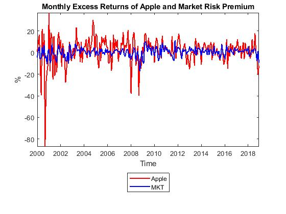
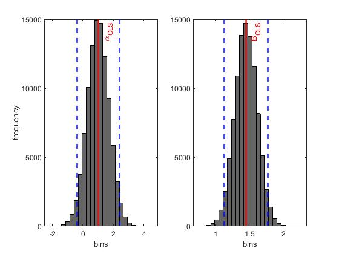

[](http://quantlet.de/)

## [](http://quantlet.de/) **TVP_VAR_Example1** [](http://quantlet.de/)

```yaml

Name of QuantLet : TVP_VAR_Example1

Published in : 'Haindorf Seminar 2020'

Description : 'Monthly Excess Returns of Apple and Market Risk Premium and Posterior distribution of alpha and beta'

Keywords : 'VAR, vector autoregressive, time varying parameter, market risk, risk premium, posterior distribution'

See also : 'TVP_VAR_Example2, TVP_VAR_Example3, TVP_VAR_Example4'

Author : 'Mike Ellington'

Submitted : January 22 2020
```





### MATLAB Code
```matlab

% Estimate excess return of Apple Stock on S&P500 Return using Bayesian
% regression with independent Normal inverse-Gamma prior and posterior

% Introduction to Gibbs Sampling
clc; clear;
addpath('../src');
addpath('..');
seed=181219;
rng(seed);
% Set number of simulations and burn-in draws
Nsim=100000; burn=10000;

% GET DATA on APPLE return, FF Market Risk Premium, and RF
% Now Data in terms of excess return of Apple, and market risk premium
% Data from January 2000-December 2018
data=xlsread('Example_1_data','Sheet1','B2:D229');
R=data(:,1)-data(:,3);
MKT=data(:,2);
clear data;

% PLOT THE DATA
yearlab=(2000:(1/12):2018+(11/12))';
figure(1)
plot(yearlab,R,'r-','LineWidth',1.5)
hold on,
plot(yearlab,MKT,'b-','LineWidth',1.5)
axis tight
ylabel('%')
xlabel('Time')
title('Monthly Excess Returns of Apple and Market Risk Premium')
legend('Apple','MKT','Location','SouthOutside')
%matlab2tikz('dat_ex1.tex')

% Now define things in terms of Y and X as in slides
% 

Y=R; X=[ones(length(Y),1), MKT];
[T,N]=size(X);

% prior
b0=[0,0]';iVb=eye(2)/100;
v0=3; S0=1*(v0-1);

% initialise Markov Chain
B=(X'*X)\X'*Y; % OLS ESTIMATES
BOLS=B;
sig2=sum((Y-X*B).^2)/T;
sigOLS=sig2;
store_theta=zeros(Nsim,3); % STORE BOTH PARAMETER DRAWS AND SIG2
K=Nsim+burn;
% start Gibbs sampler
tic;
for k=1:K
% sample B
Db=(iVb + X'*X/sig2)\speye(2); % quick way to take inverse
Bhat=Db*(iVb*b0+X'*Y/sig2);
C=chol(Db,'Lower');
B=Bhat+C*randn(N,1);
% sample sig2
e=Y-X*B;
sig2=1/gamrnd(v0+T/2,1/(S0+e'*e/2));

if k>burn
    ksave=k-burn;
    store_theta(ksave,:)=[B' sig2];
end
end
toc;
thetahat=mean(store_theta); thetaCI=quantile(store_theta,[0.025, 0.975]);

figure(2)
subplot(1,2,1)
histogram(store_theta(:,1),25,'Facecolor','k','Edgecolor','k');
xline(BOLS(1),'r-','\alpha_{OLS}','LineWidth',2);
xline(thetaCI(1,1),'b--','LineWidth',2);
xline(thetaCI(2,1),'b--','LineWidth',2);
ylabel('frequency')
xlabel('bins')
subplot(1,2,2)
histogram(store_theta(:,2),25,'Facecolor','k','Edgecolor','k')
xline(BOLS(2),'r-','B_{OLS}','LineWidth',2);
xline(thetaCI(1,2),'b--','LineWidth',2);
xline(thetaCI(2,2),'b--','LineWidth',2);
xlabel('bins')
%matlab2tikz('hist_ex1.tex')

alldraws = store_theta;
%The function momentg is taken from LeSage's toolbox
%it inputs all Gibbs draws and produces posterior
%mean, standard deviation, nse and rne
%it calculates what the book calls S(0) in various ways
%see momentg.m for more details
result = momentg(alldraws);
means=[result.pmean]';
stdevs=[result.pstd]';
nse=[result.nse]';
nse1=[result.nse1]';
nse2=[result.nse2]';
nse3=[result.nse3]';
%calculate Geweke convergence diagnostic based on first .1
%and last .4 of draws
idraw1= round(.1*Nsim);
result = momentg(alldraws(1:idraw1,:));
meansa=[result.pmean]';
nsea=[result.nse1]';

idraw2= round(.6*Nsim)+1;
result = momentg(alldraws(idraw2:Nsim,:));
meansb=[result.pmean]';
nseb=[result.nse1]';

cd = (meansa - meansb)./(nsea+nseb);

```

automatically created on 2020-01-22