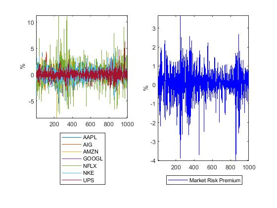
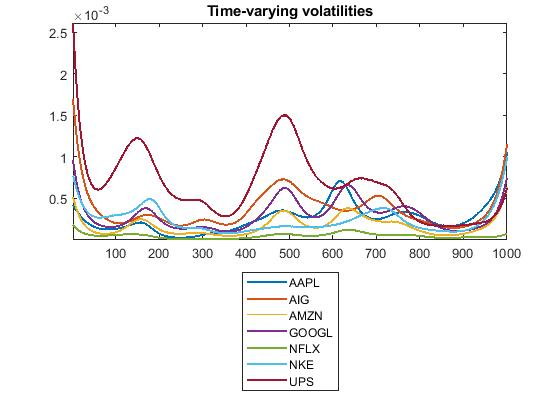
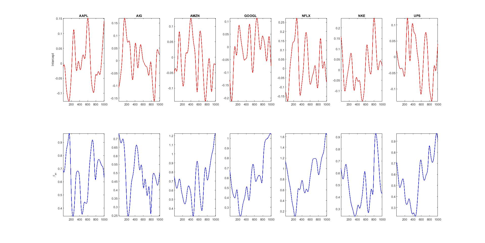

[](http://quantlet.de/)

## [](http://quantlet.de/) **TVP_VAR_Example4** [](http://quantlet.de/)

```yaml

Name of QuantLet : TVP_VAR_Example4

Published in : 'Haindorf Seminar 2020'

Description : 'Using predictive regression model QBLL to obtain time-varying betas, and time-varying volatility'

Keywords : 'Time varying parameters, time varying betas, hetero-skedastic, Bayesian, predictive regression, QBLL'

See also : 'TVP_VAR_Example1, TVP_VAR_Example2, TVP_VAR_Example3'

Author : 'Mike Ellington'

Submitted : January 22 2020
```







### MATLAB Code
```matlab

% EXAMPLE4 QBLL TVP predictive regression

clear; clc;
seed=07012020;
rng(seed);
%addpath('src')
addpath('..')

% load data
data=xlsread('Example_4_data','Sheet1','B2:I1002');

y=100*data(:,2:end); % get returns on same scale as market risk premium.
X=data(:,1);

% generate figure
figure(1)
subplot(1,2,1)
plot(y(:,:))
axis tight
ylabel('%')
legend('AAPL','AIG','AMZN','GOOGL','NFLX','NKE','UPS','Location','SouthOutside')
subplot(1,2,2)
plot(X(:,:),'b-')
axis tight
ylabel('%')
legend('Market Risk Premium','Location','SouthOutside')
%matlab2tikz('EX4_1.tex')

tic;
[betas,vols,b0]=QBLL_univariate(y,X);
toc;
%%
figure(2)
subplot(2,7,1)
plot(squeeze(betas(1,1,2,:)),'r-','LineWidth',1.2)
axis tight
ylabel('Intercept')
title('AAPL')
subplot(2,7,2)
plot(squeeze(betas(1,2,2,:)),'r-','LineWidth',1.2)
axis tight
title('AIG')
subplot(2,7,3)
plot(squeeze(betas(1,3,2,:)),'r-','LineWidth',1.2)
axis tight
title('AMZN')
subplot(2,7,4)
plot(squeeze(betas(1,4,2,:)),'r-','LineWidth',1.2)
axis tight
title('GOOGL')
subplot(2,7,5)
plot(squeeze(betas(1,5,2,:)),'r-','LineWidth',1.2)
axis tight
title('NFLX')
subplot(2,7,6)
plot(squeeze(betas(1,6,2,:)),'r-','LineWidth',1.2)
axis tight
title('NKE')
subplot(2,7,7)
plot(squeeze(betas(1,7,2,:)),'r-','LineWidth',1.2)
axis tight
title('UPS')
subplot(2,7,8)
plot(squeeze(betas(2,1,2,:)),'b-','LineWidth',1.2)
axis tight
ylabel('\beta_{m}')
subplot(2,7,9)
plot(squeeze(betas(2,2,2,:)),'b-','LineWidth',1.2)
axis tight
subplot(2,7,10)
plot(squeeze(betas(2,3,2,:)),'b-','LineWidth',1.2)
axis tight
subplot(2,7,11)
plot(squeeze(betas(2,4,2,:)),'b-','LineWidth',1.2)
axis tight
subplot(2,7,12)
plot(squeeze(betas(2,5,2,:)),'b-','LineWidth',1.2)
axis tight
subplot(2,7,13)
plot(squeeze(betas(2,6,2,:)),'b-','LineWidth',1.2)
axis tight
subplot(2,7,14)
plot(squeeze(betas(2,7,2,:)),'b-','LineWidth',1.2)
axis tight
%matlab2tikz('EX4_2.tex')

%%

figure(3)
plot(sqrt(vols(:,:,2)),'LineWidth',1.5)
axis tight
title('Time-varying volatilities')
legend('AAPL','AIG','AMZN','GOOGL','NFLX','NKE','UPS','Location','SouthOutside')
%matlab2tikz('EX4_3.tex')

```

automatically created on 2020-01-22